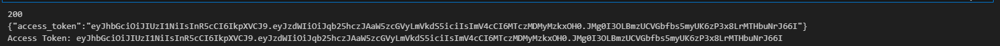
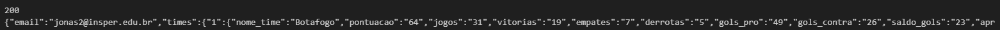

# Bem-vindo à Documentação da API
## Nome: Eduardo Selber Castanho
## Visão Geral
Esta API fornece um sistema completo de gerenciamento de usuários com autenticação baseada em JWT, além de recursos adicionais, como scraping de dados de futebol ao vivo. Abaixo está um resumo das principais funcionalidades e como utilizá-las.
## Como executar:
Para executar a API, é necessário copiar o arquivo compose.yaml para o diretório do projeto e, em seguida, no terminal desse diretório, executar o comando:
```
docker compose up --build
```
. Após alguns instantes, será possível acessar `http://localhost:8000/docs`, indicando que a API está pronta para uso.
## Principais Funcionalidades
### Registro de Usuário (`/registrar/`)
- Permite que novos usuários se registrem fornecendo seu e-mail, nome e senha.
- O sistema automaticamente faz o hash da senha antes de salvá-la no banco de dados para segurança.
- Após o registro bem-sucedido, a API gera um JWT (JSON Web Token) que pode ser usado para autenticação em chamadas subsequentes.
### Login de Usuário (`/login/`)
- Permite que usuários registrados façam login usando seu e-mail e senha.
- Verifica se a senha fornecida corresponde ao hash armazenado.
- Gera um JWT após um login bem-sucedido, que pode ser usado para autenticação.
### Consulta resultado da tabela do Brasileirão (`/consultar`)
- Permite que o usuário autenticado consulte o resultado atualizado da tabela do Campeonato Brasileiro.
- Realiza a verificação da validade do token JWT fornecido no cabeçalho da requisição.
- Retorna o e-mail do usuário e as informações mais recentes sobre a tabela do campeonato brasileiro de futebol, extraídas via scraping.
### Scraping de Dados de Futebol
- A API realiza scraping da tabela ao vivo do Campeonato Brasileiro.
- Extrai informações como posição, nome do time, pontuação, jogos, vitórias, empates, derrotas, gols pró, gols contra, saldo de gols e aproveitamento.
- Retorna apenas os times das zonas 1, 2, 3 e 4, excluindo times entre as zonas 3 e 4.
- As informações extraídas são enviadas junto com o e-mail do usuário na rota /consultar.
### Códigos para Testar a Aplicação:
## Registro de Usuário (`/registrar/`)
```py
import requests

url = "http://localhost:8000/registrar/"
payload = {
  "email": "jonas2@insper.edu.br",
  "name": "Joao",
  "senha": "123456",
}
headers = {
    "Content-Type": "application/json"
}

response = requests.post(url, json=payload, headers=headers)

print(response.status_code)
print(response.text)
```

## Login de Usuário (`/login/`)
```py
import requests

url = "http://localhost:8000/login/"
payload = {
  "email": "jonas2@insper.edu.br",
  "name": "Joao",
  "senha": "123456",
}
headers = {
    "Content-Type": "application/json"
}

response = requests.post(url, json=payload, headers=headers)

print(response.status_code)
print(response.text)

# Verifique se a resposta foi bem-sucedida e extraia o access token
if response.status_code == 200:
    data = response.json()  # Converte a resposta em formato JSON
    access_token = data.get("access_token")  # Obtém o token de acesso
    print("Access Token:", access_token)
else:
    print("Erro ao fazer login:", response.text)
```

## Consulta resultado da tabela do Brasileirão (`/consultar`)
```py
import requests

url = "http://localhost:8000/consultar"

headers = {
    "Authorization": f"Bearer {access_token}"
}

response = requests.get(url, headers=headers)

print(response.status_code)
print(response.text)

```

## Autenticação
A autenticação é feita por meio de tokens JWT. Os tokens devem ser incluídos no cabeçalho das solicitações para acessar rotas protegidas.
### Exemplo de Uso
1. **Registrar um novo usuário**: Envie uma solicitação POST para `/registrar/` com o e-mail e a senha.
2. **Fazer login**: Envie uma solicitação POST para `/login/` com as credenciais do usuário.
3. **Recuperar informações do usuário**: Envie uma solicitação GET para `/consultar`, incluindo o token JWT no cabeçalho.
## Conclusão
Esta API fornece uma solução segura e eficaz para gerenciamento de usuários e acesso a dados de futebol em tempo real. Sinta-se à vontade para explorar as rotas e integrar a API em seus projetos!